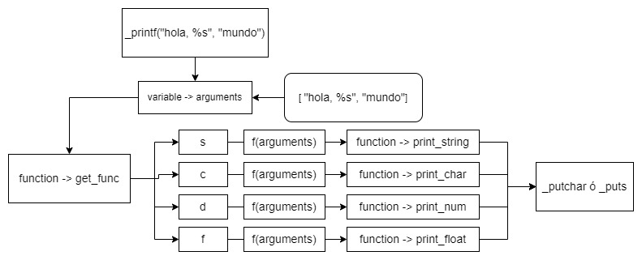

# Printf proyect group - Ecuador


## Descripcion 

The function _printf is a variadic function that produces
a string according to a format and prints it to the standard
output, much like the C standard library function "printf".
It can receive a lot of variables as arguments according the
positions with flags in the formatter.

## Prototype

```c
int _printf(const char *format, ...);
```

## Usage

_printf \- Belongs to the library stdio.h.
Allows to display (data), The function is created
printf();
Parameters are placed inside the parantheses.
The function returns a value that represents the character number

-syntax
printf("chain", value_1, value_2,...)

```c
#include "main.h"

int main(void)
{
	_printf("Hello World.\n");
	return (0);
}
```

## Example

```c
#include "main.h"

int main(void)
{
	_printf("Let\'s try to printf a simple sentence.\n");
	return (0);
}
```
## Authors - Cohort 17

- Alexander Paladines 
- Yoshua Lopez 
- Maria Paz Quirola

<p align="center">
	
</p>
